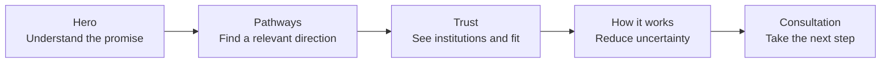

# AcdyOn

### Global learning and academic recognition for ambitious professionals.

AcdyOn is a responsive homepage concept for a premium learning platform offering executive education, applied AI programmes, doctoral pathways, and academic recognition.

The design goal is simple: make the value legible immediately, then help a visitor move from curiosity to a considered consultation.

<p>
  <a href="https://acdyon.com/">Reference site</a> ·
  <a href="./DECISIONS.md">Design decisions</a>
</p>


## The experience

The homepage is structured as a guided decision path rather than a catalogue of disconnected sections.



| Section | Job to be done |
| --- | --- |
| Hero | Establish authority, relevance, and one primary action |
| Network | Give context to AcdyOn’s international academic positioning |
| Programmes | Let visitors scan the available learning directions |
| Journey | Translate ambition into a possible progression |
| Advantage | Explain why the consultation and matching process matters |
| Featured AI track | Show a concrete programme, not only a promise |
| University network | Add academic context before the CTA |
| Process + FAQ | Answer high-consideration questions without adding pressure |
| Final CTA | Return to one clear next step |

## What makes it feel intentional

**A quiet visual system.** Warm paper, forest green, restrained borders, and Geist typography create a premium editorial tone without relying on heavy gradients or decorative clutter.

**Motion with a job.** Scroll reveals, split-text entrance, the moving network passage, and the process motion help the visitor understand progression. Reduced-motion preferences disable non-essential animation.

**Responsive by design.** The layout collapses at tablet and mobile widths, converting multi-column content into readable single-column sections and replacing desktop navigation with a mobile menu.

**Content restraint.** The homepage avoids adding unsupported performance metrics or invented social proof. Claims and institutional information should still be reviewed by AcdyOn before production publication.

## Implementation

```text
src/
├── main.jsx                 # React entry point
├── HomePage.jsx             # Page-level composition
├── styles.css               # Tokens, layout, responsive CSS, motion
├── DotField.jsx             # Decorative background texture
└── components/
    ├── Nav.jsx              # Navigation, menus, theme toggle
    ├── Hero.jsx             # Hero copy and entrance treatment
    ├── Programs.jsx         # Programme cards, journey, selector
    ├── NetworkStats.jsx     # Stats, marquee, network title
    ├── Trust.jsx             # Advantage, featured track, network, stories
    ├── Closing.jsx           # Process, FAQ, CTA, footer
    ├── SplitText.jsx         # Character-level entrance animation
    └── ui.jsx                # Shared buttons, icons, reveal hook
```

### Stack

| Tool | Reason |
| --- | --- |
| React | Composable sections and local interaction state |
| Vite | Fast development server and production build |
| CSS | Precise art direction and responsive control |
| GSAP | Controlled scroll and entrance motion |
| Geist | Consistent local typography without a runtime font dependency |

## Run locally

```bash
npm install
npm run dev
```

Open the URL printed by Vite, usually `http://localhost:5173`.

Create a production build with:

```bash
npm run build
npm run preview
```

The generated `dist/` folder can be deployed to Vercel, Netlify, or GitHub Pages.

## Quality and boundaries

- Responsive breakpoints cover desktop, tablet, and narrow mobile layouts.
- Keyboard-accessible buttons are used for menus, tabs, FAQs, and theme switching.
- `prefers-reduced-motion` is respected.
- The page renders without a runtime scraper or API dependency.
- This is a front-end exercise; it does not include authentication, CRM submission, analytics, or an admissions backend.

## Next production steps

1. Replace illustrative content with AcdyOn-approved copy and verified institution data.
2. Connect the consultation CTA to a validated, consent-aware form endpoint.
3. Add analytics for pathway views, FAQ engagement, and CTA completion.
4. Run final accessibility, performance, and cross-device checks against the deployed URL.

---

<p align="center">Built with care for AcdyOn · 2026</p>
