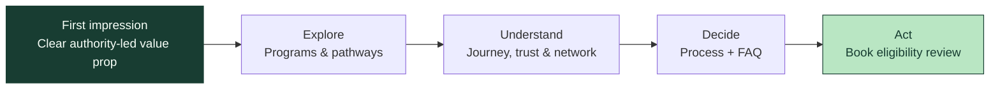
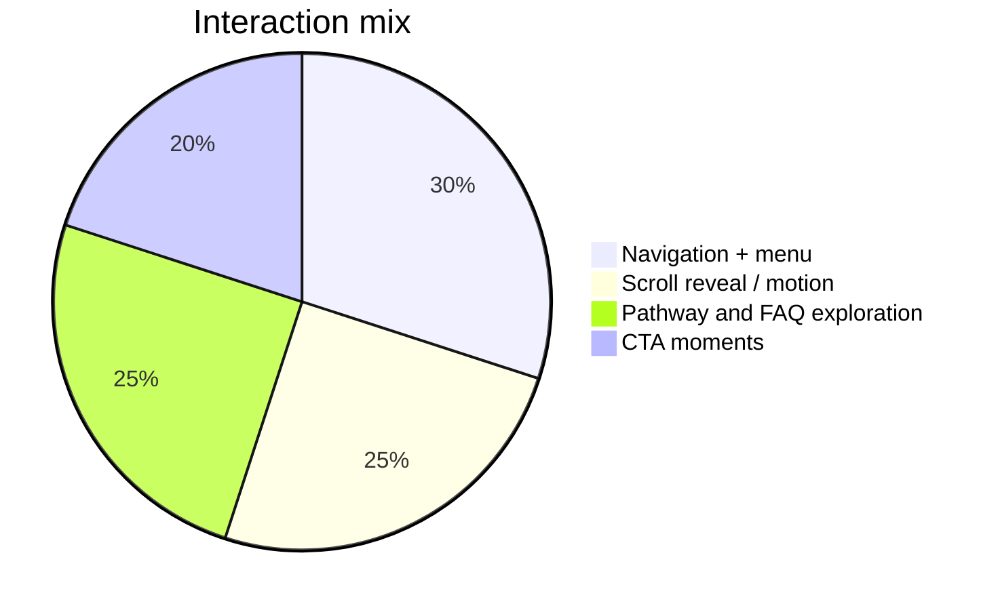

# AcdyOn — Global Learning & Recognition

<p align="center">
  <strong>A considered digital front door for ambitious professionals.</strong><br />
  Executive education · Applied AI · Doctoral pathways · Academic recognition
</p>

<p align="center">
  <a href="https://acdyon.com/">Live reference site</a> ·
  <a href="#getting-started">Run locally</a> ·
  <a href="./DECISIONS.md">Design decisions</a>
</p>

<p align="center">
  
  
  
  
</p>

<br />

> **The brief:** make someone understand the value in three seconds, then give them a reason to explore.

## ✦ What this is

This is a responsive homepage redesign for **AcdyOn**, shaped around a premium editorial feel rather than a generic education template. The experience moves from a clear credential-led hero into programmes, pathways, trust signals, process, FAQ, and a final consultation CTA.

The visual language is intentionally quiet: warm paper surfaces, forest green, generous spacing, Geist typography, subtle grid/dot fields, and motion that supports orientation instead of competing for attention.

## ✨ Experience map



## 🧭 Homepage sections

| Moment | What the visitor gets | Interaction |
| --- | --- | --- |
| Hero | A direct value proposition around authority and recognition | Split-text entrance + CTA |
| Network | Context for geographic reach and academic partners | Animated marquee / scroll title |
| Programmes | A scan-friendly view of the learning routes | Hover states + pathway links |
| Featured AI track | A concrete example of applied learning | Curriculum / mentorship / project framing |
| University network | Academic context before conversion | Registry-style responsive layout |
| Process & FAQ | Objection handling without pressure | Accordion + scroll-driven process motion |
| Final CTA | One clear next action | Consultation CTA |

## 📊 Interaction budget

The page uses a small number of purposeful interactions so the hierarchy stays readable.



## 🎨 Visual direction

<table>
  <tr>
    <td width="50%"></td>
    <td width="50%">
      <h3>Premium, not loud.</h3>
      <p>The design uses editorial pacing and restrained contrast to make high-consideration decisions feel clear and credible.</p>
      <p><code>#183D32</code> forest · <code>#FCFBF8</code> paper · Geist Sans · Geist Mono</p>
    </td>
  </tr>
</table>

## 🧱 Component structure

```text
src/
├── HomePage.jsx              # Page composition
├── styles.css                # Design system, responsive rules, motion
├── DotField.jsx              # Decorative background texture
└── components/
    ├── Nav.jsx               # Desktop / mobile navigation + theme control
    ├── Hero.jsx              # First-screen value proposition
    ├── Programs.jsx          # Programme cards and pathway selector
    ├── NetworkStats.jsx      # Network facts and marquee treatment
    ├── Trust.jsx             # Advantage, featured track, network, stories
    ├── Closing.jsx           # Process, FAQ, CTA and footer
    ├── SplitText.jsx         # Lightweight entrance animation
    └── ui.jsx                # Shared buttons, icons, sections, reveal hook
```

## 🛠️ Tech choices

- **React** for composable sections and local interaction state.
- **Vite** for a fast, minimal build pipeline.
- **CSS-first visual system** for precise responsive control and easy handoff.
- **GSAP / IntersectionObserver** for deliberate entrance and scroll motion.
- **Local Geist fonts** to keep typography consistent without relying on a font request at runtime.

## Getting started

### Requirements

- Node.js 18+
- npm 9+

### Install and run

```bash
npm install
npm run dev
```

Open the local URL printed by Vite, usually `http://localhost:5173`.

### Production build

```bash
npm run build
npm run preview
```

## ✅ Quality checklist

- Responsive layout includes a mobile breakpoint for narrow screens.
- Reduced-motion users are respected through `prefers-reduced-motion` rules.
- Navigation, FAQ, theme control, and CTAs are keyboard-focusable controls.
- The page is static and deployable to Vercel, Netlify, or GitHub Pages.
- No runtime scraper or external data dependency is required to render the page.

## Honesty note

This repository is a design and front-end exercise. It does not include a live admissions backend, CRM submission, analytics pipeline, or authentication flow. Any programme claims, partner information, testimonials, and numerical proof points should be reviewed by AcdyOn before production publication.

See [DECISIONS.md](./DECISIONS.md) for the reasoning behind the content and ingestion approach.

---

<p align="center">Built with care for AcdyOn ✦</p>
