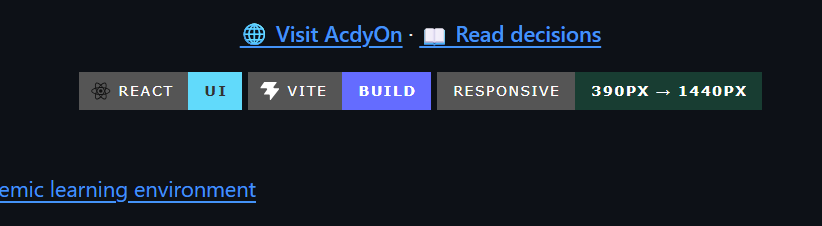
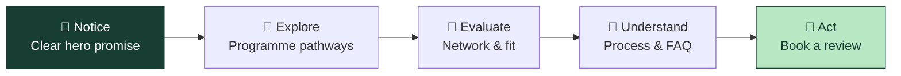
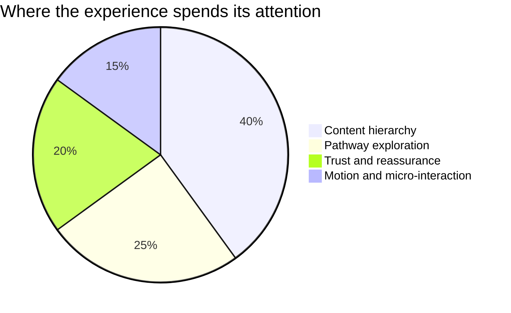
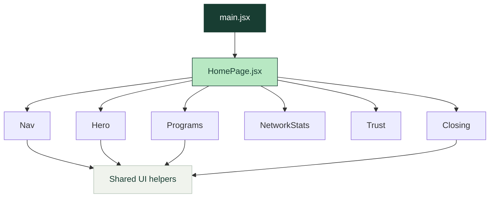

<div align="center">

# AcdyOn

### Global learning and academic recognition for ambitious professionals.

<p>A premium, responsive homepage concept designed to turn attention into a considered next step.</p>

<p>
  <a href="https://acdyon.com/"><strong>🌐 Visit AcdyOn</strong></a> ·
  <a href="./DECISIONS.md"><strong>📖 Read decisions</strong></a>
</p>


</div>

<br />

<div align="center">

| ✦ FIRST IMPRESSION | ✦ PRODUCT MOMENT | ✦ NEXT ACTION |
| :---: | :---: | :---: |
| Clear value proposition | Guided programme pathways | Eligibility review |

</div>

## ✦ The idea

AcdyOn brings together executive education, applied AI programmes, doctoral pathways, and academic recognition.

This homepage is built around a simple conversion principle:

> **In the first three seconds, a visitor should understand the value, recognise where they fit, and see one confident next action.**

The experience uses editorial spacing, forest-green contrast, local Geist typography, and restrained motion to make a high-consideration decision feel clear rather than overwhelming.

## 🧭 Visitor journey



## 📊 Interaction design

Every interaction earns its place by helping the visitor orient, compare, or commit.



| Moment | Purpose | Interaction |
| --- | --- | --- |
| 🎯 Hero | Make the promise immediately understandable | Split-text entrance + primary CTA |
| 🧩 Programmes | Help visitors identify a relevant route | Programme cards + pathway selector |
| 🌍 Network | Provide academic and geographic context | Animated marquee / network passage |
| 🛡️ Advantage | Explain why guidance matters | Expandable information cards |
| 🤖 Featured AI track | Show the offer, not just claim it | Curriculum, mentorship, and project detail |
| ❓ FAQ | Reduce uncertainty | Accordion interaction |
| 📞 Final CTA | Return to one clear next step | Consultation action |

## 🎨 Visual system

<table>
<tr>
<td width="50%">

### Colour

| Token | Use |
| --- | --- |
| `#183D32` | Authority, CTA, dark surfaces |
| `#FCFBF8` | Main paper background |
| `#E6E9E1` | Soft surfaces and separation |
| `#6A716B` | Supporting copy |

</td>
<td width="50%">

### Type

**Geist Sans** keeps the page warm and readable.  
**Geist Mono** creates a technical layer for labels, steps, and metadata.

The result is intentionally quiet: fewer competing elements, stronger hierarchy.

</td>
</tr>
</table>

## 🧱 Architecture



```text
src/
├── main.jsx                 # Application entry point
├── HomePage.jsx             # Page-level composition
├── styles.css               # Design system, responsive CSS, motion
├── DotField.jsx             # Decorative background texture
└── components/
    ├── Nav.jsx              # Navigation, menus, theme control
    ├── Hero.jsx             # First-screen value proposition
    ├── Programs.jsx         # Programme cards and pathway selector
    ├── NetworkStats.jsx     # Stats, marquee, network treatment
    ├── Trust.jsx             # Advantage, AI track, network, stories
    ├── Closing.jsx           # Process, FAQ, CTA, footer
    ├── SplitText.jsx         # Character-level entrance animation
    └── ui.jsx                # Buttons, icons, sections, reveal hook
```

## 🛠️ Technology choices

| Technology | Why it is used |
| --- | --- |
| ⚛️ React | Composable sections and local interaction state |
| ⚡ Vite | Fast development and production builds |
| 🎨 CSS | Precise art direction and responsive control |
| 🎬 GSAP | Scroll and entrance motion support |
| 🔤 Geist | Consistent local typography without runtime font dependence |

## 🚀 Run locally

### Requirements

- Node.js 18+
- npm 9+

```bash
# Install dependencies
npm install

# Start the development server
npm run dev
```

Open the URL printed by Vite, usually `http://localhost:5173`.

### Production build

```bash
npm run build
npm run preview
```

The generated `dist/` directory can be deployed to **Vercel**, **Netlify**, or **GitHub Pages**.

## ✅ Quality checklist

| Check | Status |
| --- | :---: |
| Responsive layout for desktop and mobile | ✅ |
| No runtime scraper or external data dependency | ✅ |
| Keyboard-friendly interactive controls | ✅ |
| Reduced-motion support | ✅ |
| Dark-mode rules included consistently | ✅ |
| Authentication / CRM integration | ⏳ Future work |
| Production analytics | ⏳ Future work |

## 🔐 Honest boundaries

This repository is a front-end design exercise. It does not include authentication, CRM submission, analytics, a CMS, or a live admissions backend.

Before production launch:

1. Replace illustrative content with AcdyOn-approved copy.
2. Verify all programme, institution, and recognition claims.
3. Connect the consultation CTA to a secure, consent-aware endpoint.
4. Test accessibility, performance, and the deployed URL across real devices.

The reasoning behind the ingestion approach, trade-offs, and AI-assisted workflow is documented in [DECISIONS.md](./DECISIONS.md).

<div align="center">

### Built with care for AcdyOn ✦

**Global learning · Applied AI · Academic recognition**

</div>
